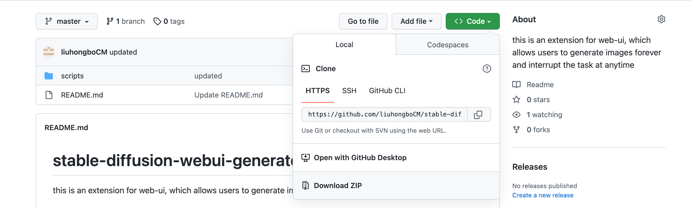
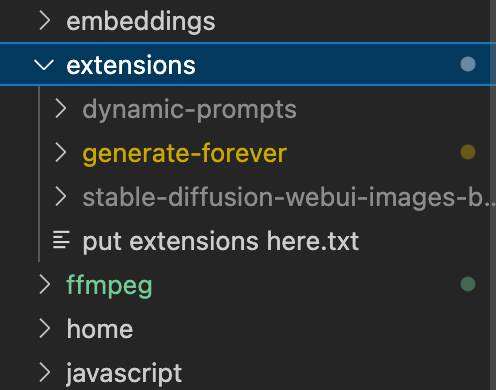
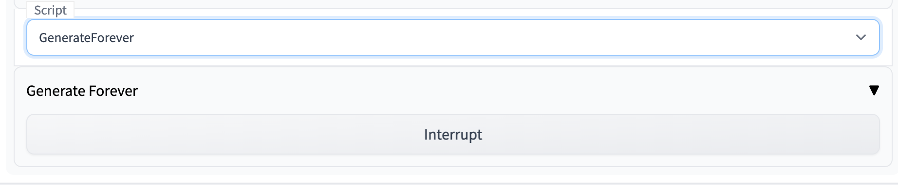

# stable-diffusion-webui-generate-forever

this is an extension for web-ui, which allows users to generate images forever and interrupt the task at anytime.

## setup

1. Download the zip

2. unzip the zip file to the project folder: ./extensions

   

3.run the project, if everything is ok,you would see the 'GenerateForever' option in the Dropdown UI 'script',select it and click 'Generate' Button,then you can see all generated images in Tab 'Image Browser'

## notice

- Click 'Interrupt' Button if you want to interrupt a generating-forever process,but this won't interrupt other normal process.
- Max number of generating-forever process is 1,if you want to make another generating-forever process, click 'Interrupt' Button first.
- The parameter 'seed' is set to -1 in a  generating-forever process
- Use ImageBrowser(repo:https://github.com/yfszzx/stable-diffusion-webui-images-browser) to see all images in a generating-forever process
